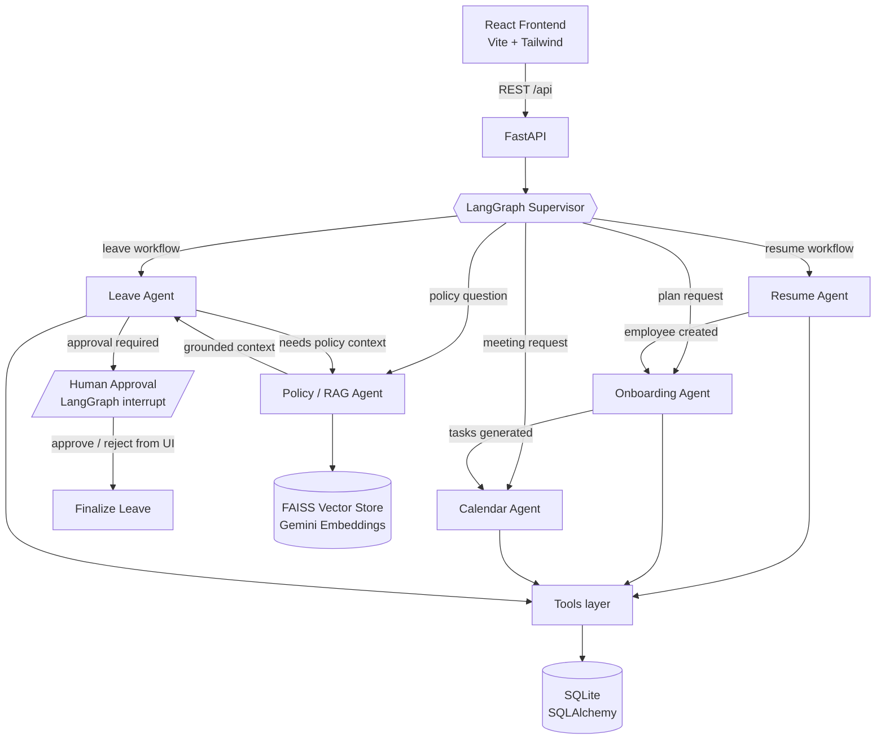

# Agentic AI Employee Onboarding System

A working prototype that demonstrates how **LangGraph orchestrates five specialized AI agents** to automate employee onboarding: resume parsing, onboarding plan generation, meeting scheduling, leave management with human-in-the-loop approval, and HR policy Q&A via RAG.

**Stack:** Python 3.12 · FastAPI · LangGraph · LangChain · Gemini (LLM + embeddings) · FAISS · SQLAlchemy/SQLite · React · Vite · Tailwind CSS

---

## 1. Architecture



All agents communicate **only through shared LangGraph state** (`app/graph/state.py`) — they are not independent chatbots. A SQLite-backed checkpointer persists graph state, so a leave workflow can pause at the human-approval interrupt and resume later, even across server restarts.

## 2. The Five Agents

| Agent | File | Responsibility | LLM usage |
|---|---|---|---|
| **Supervisor** | `app/agents/supervisor.py` | Classifies requests, routes via conditional edges | Intent classification only (keyword fallback) |
| **Resume Agent** | `app/agents/resume_agent.py` | PDF → text → structured profile → employee record | Extraction only (regex/heuristic fallback). Never makes hiring decisions. |
| **Onboarding Agent** | `app/agents/onboarding_agent.py` | Generates role/department-aware task plan, stores tasks | None — fully deterministic templates (Rule 2) |
| **Calendar Agent** | `app/agents/calendar_agent.py` | Schedules/reschedules/cancels meetings against a mock calendar with realistic availability (work hours, lunch, conflicts) | None — deterministic slot finding. Provider is swappable for Google Calendar / MS Graph. |
| **Leave Agent** | `app/agents/leave_agent.py` | Parses leave requests, consults Policy Agent, applies balance/approval rules, pauses for human approval | Parsing natural language only. Dates, balances, approvals, status transitions are deterministic code in `app/tools/leave_tools.py`. |
| **Policy / RAG Agent** | `app/agents/policy_agent.py` | FAISS retrieval over `backend/data/policies/*.txt`, grounded answers | Answering from retrieved chunks only. Returns "I could not find enough information…" instead of hallucinating. |

## 3. LangGraph Workflows

**Resume upload** (triggered by `POST /api/resumes/upload`):

```
supervisor → resume_agent → onboarding_agent → calendar_agent → END
             (profile)       (10 tasks)         (6 meetings)
```

**Leave request** (triggered by `POST /api/leave`):

```
supervisor → leave_agent(intake) → policy_agent → leave_agent(decide)
                                                       │
                        auto-approved / rejected ──────┤→ END
                        approval required ─────────────┴→ human_approval (interrupt)
                                                              │ UI: Approve / Reject
                                                              ▼
                                                        finalize_leave → END
```

**Policy question**: `supervisor → policy_agent → END`

Human-in-the-loop uses LangGraph's real `interrupt()` + `Command(resume=...)` with a SQLite checkpointer. If the checkpoint thread is unavailable, the API falls back to a deterministic DB decision so approvals never get stuck.

## 4. Project Structure

```
onboarding-agent/
├── backend/
│   ├── app/
│   │   ├── main.py               # FastAPI app, lifespan (init DB, seed, warm FAISS)
│   │   ├── config.py             # env-driven settings
│   │   ├── agents/               # supervisor + 5 agents + shared LLM helper
│   │   ├── graph/                # state.py (shared state), workflow.py (StateGraph)
│   │   ├── tools/                # deterministic action tools used by agents
│   │   ├── security.py           # PBKDF2 password hashing + JWT sign/verify
│   │   ├── api/                  # routers + Pydantic schemas
│   │   │   ├── deps.py           # get_current_user + require_hr / require_manager / require_manager_or_self
│   │   │   ├── auth.py           # login, me, demo-accounts
│   │   │   └── me.py             # self-service scope (/me/*, /team/*)
│   │   ├── db/                   # database.py, models.py, crud.py, seed.py
│   │   └── rag/                  # ingest.py (FAISS build), retriever.py (fallback)
│   ├── data/policies/            # 5 HR policy .txt documents
│   ├── requirements.txt
│   ├── .env.example
│   └── Dockerfile
├── frontend/
│   ├── src/
│   │   ├── pages/                # Login, MyHome, MyTasks, MyLeave, MyMeetings,
│   │   │                         # MyTeam + Dashboard, Employees, Resumes, Onboarding,
│   │   │                         # Calendar, Leave, Policies, Agent Activity, Settings
│   │   ├── layouts/Layout.jsx    # dark sidebar shell, role-aware nav
│   │   ├── context/AuthContext.jsx  # token state, login/logout, 401 handling
│   │   ├── components/guards.jsx    # RequireAuth, RequireRole
│   │   ├── components/ui.jsx     # badges, cards, modal, progress bar
│   │   ├── services/api.js       # axios client (attaches bearer token)
│   │   └── hooks/useFetch.js
│   ├── Dockerfile + nginx.conf
├── docker-compose.yml
└── README.md
```

## 5. Running Locally (without Docker)

### Backend

```bash
cd backend
python3 -m venv .venv && source .venv/bin/activate
pip install -r requirements.txt
cp .env.example .env          # add your GEMINI_API_KEY (optional, see below)
uvicorn app.main:app --reload --port 8000
```

The first startup creates the SQLite DB and seeds demo data: **7 employees, ~50 tasks, 8 meetings, 3 leave requests, leave balances, and 7 login accounts** (see §5.1).

### Frontend

```bash
cd frontend
npm install
npm run dev                   # http://localhost:5173 (proxies /api to :8000)
```

### Gemini API key (optional but recommended)

Get a free key at https://aistudio.google.com/app/apikey and put it in `backend/.env`:

```
GEMINI_API_KEY=your-key
```

**The system works without the key** (Rule 7): resume extraction falls back to heuristics, policy answers quote retrieved documents via keyword search, and all CRUD/leave/calendar logic is deterministic anyway. With the key you additionally get LLM extraction, grounded Gemini answers, FAISS semantic retrieval, and free-text intent routing.

### 5.1 Login and roles

Every endpoint except `/api/health`, `/api/auth/login` and `/docs` requires `Authorization: Bearer <token>`.
Passwords are hashed with PBKDF2-SHA256 (`app/security.py`); tokens are HS256 JWTs carrying `sub`, `role` and `employee_id`.

Three roles, enforced server-side in `app/api/deps.py` and enforced again on every query in `app/db/crud.py`:

| Role | Demo login | Can do |
|---|---|---|
| **EMPLOYEE** | `employee1021@xyzcorp.com` | Only their **own** tasks, meetings, leave and balances. Cannot see other employees, the org directory, resumes, or approve anything. |
| **MANAGER** | `manage1234@xyzcorp.com` | Everything an employee can, plus their **direct reports** (`/api/team`), dashboard scoped to their team, and approve/reject their reports' leave. No access to resumes or the full employee directory. |
| **HR** | `hr1000@xyzcorp.com` | Full access: all employees, resume upload, org-wide dashboard, and leave decisions company-wide. |

Password for all seeded accounts: **`Demo@1234`** (override with `DEMO_PASSWORD`).

### 5.2 Adding a user — the email prefix sets the role

`POST /api/employees` (HR only) creates the employee **and** their login in one step. The access role is derived from the text in front of the employee id in the email address:

| Email looks like | Prefix | Access role |
|---|---|---|
| `hr1000@…`, `hr_admin77@…`, `admin9@…` | `hr`, `hradmin`, `admin`, `humanresources` | **HR** |
| `manage1234@…`, `manager7@…`, `mgr55@…`, `lead3@…`, `supervisor8@…` | `manage`, `manager`, `mgr`, `lead`, `supervisor` | **MANAGER** |
| `employee1021@…`, `emp9@…`, `staff4@…`, `user2@…` | `employee`, `emp`, `staff`, `user` | **EMPLOYEE** |

Prefixes are matched case-insensitively, and separators are ignored (`hr_1000` and `hr-1000` both work). Anything else is **rejected with 422** rather than silently downgraded, so a typo like `bob9004@…` fails loudly instead of quietly creating an under-privileged account:

```
'bob' is not a recognised role prefix. Use one of:
admin, emp, employee, hr, hradmin, humanresources, lead, manage, manager, mgr, staff, supervisor, user
— or pass an explicit login_role.
```

HR can override the outcome per-employee with `login_role` (`HR` / `MANAGER` / `EMPLOYEE`) and set a custom `login_password` (min 8 chars; omitting it uses the demo password). The response echoes back what was granted and why (`role_source`, `role_reason`).

Two supporting endpoints:

- `GET /api/employees/role-preview?email=…` — returns the role an address would get, so the Add Employee form can show it live while typing.
- `PATCH /api/employees/{id}/role` — change an existing user's role. Takes effect on their next login, since the role is read from the database on every request rather than trusted from the token.

The Add Employee modal shows a green "will be created as MANAGER" hint for a recognized prefix and an amber warning (with Create disabled) for an unrecognized one.

**Scope is enforced on reads, not just writes.** An employee requesting `/api/tasks?employee_id=<someone else>` gets an empty list (the query is filtered to their own id); a manager requesting a non-report gets the same. `/api/me/*` derives the employee from the token and **ignores any `employee_id` in the request body**, so a self-service caller cannot submit leave on someone else's behalf.

Scope is derived from the seeded `manager_id` hierarchy in `db/models.py` (Priya → Arun, Vikram, Daniel; Anil → Sneha; Meera is HR), not hardcoded per user.

## 6. Running with Docker

```bash
cp backend/.env.example backend/.env   # edit GEMINI_API_KEY if desired
docker compose up --build
```

- Frontend: http://localhost:8080
- Backend API docs: http://localhost:8000/docs

## 7. API Overview

| Method | Endpoint | Purpose |
|---|---|---|
| POST | `/api/auth/login` | Exchange email + password for a JWT |
| GET | `/api/auth/me` | Current user profile from the token |
| POST | `/api/auth/demo-accounts` | Demo helper: seeded logins for the login screen |
| POST | `/api/employees` | Create employee **and** login; role from the email prefix (HR only) |
| GET | `/api/employees/role-preview?email=` | Which role would this email get? (HR only) |
| PATCH | `/api/employees/{id}/role` | Change an existing user's access role (HR only) |
| GET | `/api/me/summary` | Self-service landing summary (tasks, progress, balances) |
| GET | `/api/me/tasks` | Own tasks only |
| PATCH | `/api/me/tasks/{id}` | Update own task status |
| GET | `/api/me/meetings` | Own meetings only |
| PATCH | `/api/me/meetings/{id}` | Mark own meeting attended / absent |
| GET/POST | `/api/me/leave` | Own leave requests / file a request (id from token) |
| GET | `/api/me/leave/balances` | Own leave balances |
| GET | `/api/me/profile` | Own full profile |
| GET | `/api/team` | Direct reports — manager/HR only |
| GET | `/api/team/{employee_id}` | One report's detail — manager/HR only |
| POST | `/api/resumes/upload` | Upload PDF → Resume→Onboarding→Calendar workflow (HR only) |
| GET | `/api/employees` | List employees (HR only) |
| GET | `/api/employees/{id}` | Profile + progress + tasks + meetings + leave + balances (HR only) |
| GET | `/api/tasks` | List tasks (`?employee_id=&status=`), scoped to caller |
| PATCH | `/api/tasks/{id}` | Update task status (own, or any report for a manager) |
| GET/POST | `/api/meetings` | List / schedule, scoped to caller (HR/manager) |
| PATCH | `/api/meetings/{id}` | Reschedule or cancel |
| GET/POST | `/api/leave` | List / submit (runs leave workflow) |
| GET | `/api/leave/balances` | Leave balances, scoped to caller |
| POST | `/api/leave/{id}/approve` | Human approval (resumes interrupted graph) |
| POST | `/api/leave/{id}/reject` | Human rejection |
| POST | `/api/policy/query` | RAG policy question (any signed-in user) |
| POST | `/api/agent/run` | Generic entry: free text through the supervisor (HR only) |
| GET | `/api/agent/logs` | Agent activity feed (real logs), scoped to caller |
| GET | `/api/agent/status` | LLM/RAG health |
| GET | `/api/dashboard/stats` | Dashboard aggregates (HR / manager) |

Interactive docs at `http://localhost:8000/docs`.

## 8. Example Workflows to Try

1. **Sign in as the employee** (`employee1021@xyzcorp.com` / `Demo@1234`) → you land on **My Home** and see only Arun's own tasks, meetings and leave. Open `/employees` in the URL bar and you get bounced back — the nav for this role doesn't even offer it.
2. **Leave with human approval**: sign in as the manager (`manage1234@xyzcorp.com`) → Leave page → New Request for a report → CASUAL, 3+ days → Leave Agent validates dates/balance, pulls policy context, and pauses. The request appears under *Awaiting Approval* → click Approve → the LangGraph thread resumes, the DB and balance update, and `decided_by` records *Priya Sharma (MANAGER)*.
3. **Auto-approval**: submit a 1-day SICK leave as the employee → auto-approved per policy (≤2 days, balance OK), `decided_by` = `AutoApproval`.
4. **Resume → full onboarding**: sign in as HR (`hr1000@xyzcorp.com`) → Resumes page → drop a PDF → watch Resume Agent extract the profile, Onboarding Agent generate ~10 tasks, Calendar Agent schedule 6 meetings. Then open the new employee's detail page.
5. **Policy chat**: HR Policies page → "How many casual leave days can I take?" → grounded answer with source files listed.
6. **Agent Activity**: open the Agent Activity page while doing any of the above — every step is a real log row from `agent_logs`.

## 9. Design Rules Followed

1. Agents act through tools (`app/tools/*`), never by claiming actions.
2. Critical business logic (balances, dates, statuses, approvals) is deterministic Python.
3. Policies are retrieved via RAG, not pasted into prompts.
4. Agents communicate only through shared LangGraph state.
5. Each agent is small and specialized.
6. Every important action writes an `agent_logs` row, shown live in the UI.
7. Everything degrades gracefully without the LLM.
8. Authorization is enforced server-side on every request and on every query — never by hiding UI links.

## 10. Future Improvements

- Real Google Calendar / Microsoft Graph provider behind `calendar_tools` (interface already isolated).
- Email/Slack notifications to managers when a leave approval interrupt fires.
- LangSmith tracing for graph observability.
- OCR (e.g., Gemini vision) for scanned resumes.
- Postgres + Alembic migrations when moving beyond the prototype.
- Pro-rated leave balances for mid-year joiners.
- Refresh tokens / token revocation, and moving the JWT secret to a real secret manager.
