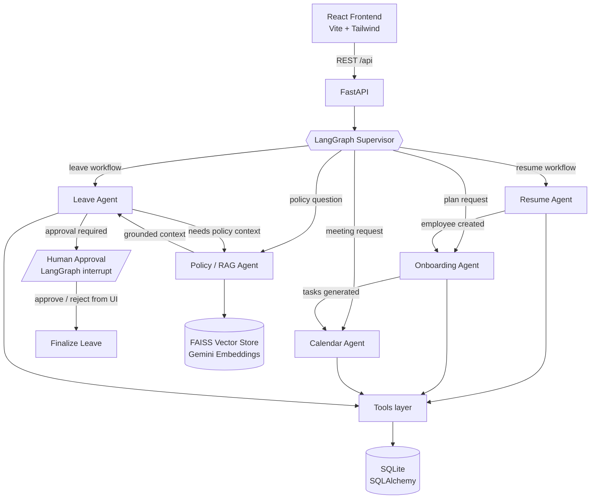

# Agentic AI Employee Onboarding System

A working prototype that demonstrates how **LangGraph orchestrates five specialized AI agents** to automate employee onboarding: resume parsing, onboarding plan generation, meeting scheduling, leave management with human-in-the-loop approval, and HR policy Q&A via RAG.

**Stack:** Python 3.12 · FastAPI · LangGraph · LangChain · Gemini (LLM + embeddings) · FAISS · SQLAlchemy/SQLite · React · Vite · Tailwind CSS

---

## 1. Architecture



All agents communicate **only through shared LangGraph state** (`app/graph/state.py`) — they are not independent chatbots. A SQLite-backed checkpointer persists graph state, so a leave workflow can pause at the human-approval interrupt and resume later, even across server restarts.

## 2. The Five Agents

| Agent | File | Responsibility | LLM usage |
|---|---|---|---|
| **Supervisor** | `app/agents/supervisor.py` | Classifies requests, routes via conditional edges | Intent classification only (keyword fallback) |
| **Resume Agent** | `app/agents/resume_agent.py` | PDF → text → structured profile → employee record | Extraction only (regex/heuristic fallback). Never makes hiring decisions. |
| **Onboarding Agent** | `app/agents/onboarding_agent.py` | Generates role/department-aware task plan, stores tasks | None — fully deterministic templates (Rule 2) |
| **Calendar Agent** | `app/agents/calendar_agent.py` | Schedules/reschedules/cancels meetings against a mock calendar with realistic availability (work hours, lunch, conflicts) | None — deterministic slot finding. Provider is swappable for Google Calendar / MS Graph. |
| **Leave Agent** | `app/agents/leave_agent.py` | Parses leave requests, consults Policy Agent, applies balance/approval rules, pauses for human approval | Parsing natural language only. Dates, balances, approvals, status transitions are deterministic code in `app/tools/leave_tools.py`. |
| **Policy / RAG Agent** | `app/agents/policy_agent.py` | FAISS retrieval over `backend/data/policies/*.txt`, grounded answers | Answering from retrieved chunks only. Returns "I could not find enough information…" instead of hallucinating. |

## 3. LangGraph Workflows

**Resume upload** (triggered by `POST /api/resumes/upload`):

```
supervisor → resume_agent → onboarding_agent → calendar_agent → END
             (profile)       (10 tasks)         (6 meetings)
```

**Leave request** (triggered by `POST /api/leave`):

```
supervisor → leave_agent(intake) → policy_agent → leave_agent(decide)
                                                       │
                        auto-approved / rejected ──────┤→ END
                        approval required ─────────────┴→ human_approval (interrupt)
                                                              │ UI: Approve / Reject
                                                              ▼
                                                        finalize_leave → END
```

**Policy question**: `supervisor → policy_agent → END`

Human-in-the-loop uses LangGraph's real `interrupt()` + `Command(resume=...)` with a SQLite checkpointer. If the checkpoint thread is unavailable, the API falls back to a deterministic DB decision so approvals never get stuck.

## 4. Project Structure

```
onboarding-agent/
├── backend/
│   ├── app/
│   │   ├── main.py               # FastAPI app, lifespan (init DB, seed, warm FAISS)
│   │   ├── config.py             # env-driven settings
│   │   ├── agents/               # supervisor + 5 agents + shared LLM helper
│   │   ├── graph/                # state.py (shared state), workflow.py (StateGraph)
│   │   ├── tools/                # deterministic action tools used by agents
│   │   ├── api/                  # routers + Pydantic schemas
│   │   ├── db/                   # database.py, models.py, crud.py, seed.py
│   │   └── rag/                  # ingest.py (FAISS build), retriever.py (fallback)
│   ├── data/policies/            # 5 HR policy .txt documents
│   ├── requirements.txt
│   ├── .env.example
│   └── Dockerfile
├── frontend/
│   ├── src/
│   │   ├── pages/                # Dashboard, Employees, Resumes, Onboarding,
│   │   │                         # Calendar, Leave, Policies, Agent Activity, Settings
│   │   ├── layouts/Layout.jsx    # dark sidebar shell
│   │   ├── components/ui.jsx     # badges, cards, modal, progress bar
│   │   ├── services/api.js       # axios client
│   │   └── hooks/useFetch.js
│   └── Dockerfile + nginx.conf
├── docker-compose.yml
└── README.md
```

## 5. Running Locally (without Docker)

### Backend

```bash
cd backend
python3 -m venv .venv && source .venv/bin/activate
pip install -r requirements.txt
cp .env.example .env          # add your GEMINI_API_KEY (optional, see below)
uvicorn app.main:app --reload --port 8000
```

The first startup creates the SQLite DB and seeds demo data: **5 employees, ~50 tasks, 8 meetings, 3 leave requests, leave balances**.

### Frontend

```bash
cd frontend
npm install
npm run dev                   # http://localhost:5173 (proxies /api to :8000)
```

### Gemini API key (optional but recommended)

Get a free key at https://aistudio.google.com/app/apikey and put it in `backend/.env`:

```
GEMINI_API_KEY=your-key
```

**The system works without the key** (Rule 7): resume extraction falls back to heuristics, policy answers quote retrieved documents via keyword search, and all CRUD/leave/calendar logic is deterministic anyway. With the key you additionally get LLM extraction, grounded Gemini answers, FAISS semantic retrieval, and free-text intent routing.

## 6. Running with Docker

```bash
cp backend/.env.example backend/.env   # edit GEMINI_API_KEY if desired
docker compose up --build
```

- Frontend: http://localhost:8080
- Backend API docs: http://localhost:8000/docs

## 7. API Overview

| Method | Endpoint | Purpose |
|---|---|---|
| POST | `/api/resumes/upload` | Upload PDF → runs Resume→Onboarding→Calendar workflow |
| GET/POST | `/api/employees` | List / create employees |
| GET | `/api/employees/{id}` | Profile + progress + tasks + meetings + leave + balances |
| GET | `/api/tasks` | List tasks (`?employee_id=&status=`) |
| PATCH | `/api/tasks/{id}` | Update task status |
| GET/POST | `/api/meetings` | List / schedule (auto-slot if no time given) |
| PATCH | `/api/meetings/{id}` | Reschedule or cancel |
| GET/POST | `/api/leave` | List / submit (runs leave workflow) |
| GET | `/api/leave/balances` | Leave balances |
| POST | `/api/leave/{id}/approve` | Human approval (resumes interrupted graph) |
| POST | `/api/leave/{id}/reject` | Human rejection |
| POST | `/api/policy/query` | RAG policy question |
| POST | `/api/agent/run` | Generic entry: free text through the supervisor |
| GET | `/api/agent/logs` | Agent activity feed (real logs) |
| GET | `/api/agent/status` | LLM/RAG health |
| GET | `/api/dashboard/stats` | Dashboard aggregates |

Interactive docs at `http://localhost:8000/docs`.

## 8. Example Workflows to Try

1. **Resume → full onboarding**: Resumes page → drop a PDF → watch Resume Agent extract the profile, Onboarding Agent generate ~10 tasks, Calendar Agent schedule 6 meetings. Then open the new employee's detail page.
2. **Leave with human approval**: Leave page → New Request → CASUAL, 3+ days → Leave Agent validates dates/balance, pulls policy context, and pauses. The request appears under *Awaiting Approval* → click Approve → the LangGraph thread resumes and the DB + balance update.
3. **Auto-approval**: Submit a 1-day SICK leave → auto-approved per policy (≤2 days, balance OK).
4. **Policy chat**: HR Policies page → "How many casual leave days can I take?" → grounded answer with source files listed.
5. **Agent Activity**: open the Agent Activity page while doing any of the above — every step is a real log row from `agent_logs`.

## 9. Design Rules Followed

1. Agents act through tools (`app/tools/*`), never by claiming actions.
2. Critical business logic (balances, dates, statuses, approvals) is deterministic Python.
3. Policies are retrieved via RAG, not pasted into prompts.
4. Agents communicate only through shared LangGraph state.
5. Each agent is small and specialized.
6. Every important action writes an `agent_logs` row, shown live in the UI.
7. Everything degrades gracefully without the LLM.

## 10. Future Improvements

- Real Google Calendar / Microsoft Graph provider behind `calendar_tools` (interface already isolated).
- Email/Slack notifications to managers when a leave approval interrupt fires.
- Multi-user auth (HR admin vs. employee self-service views).
- LangSmith tracing for graph observability.
- OCR (e.g., Gemini vision) for scanned resumes.
- Postgres + Alembic migrations when moving beyond the prototype.
- Pro-rated leave balances for mid-year joiners.
